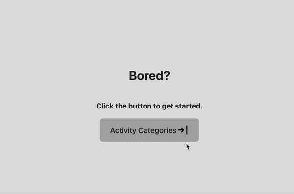

  
# Activity Generator

# Table of Contents
- [Description](#description)
- [Installation](#installation)
- [Wireframing](#wireframing)
- [Development Process](#development-process)
- [Usage](#usage)
- [App in Use](#app-in-use)
- [Questions](#questions)
- [License](#license)
## Description
This project is a front-end API built in Vite + React that allows bored users to randomly generate an activity based on a category of their choosing.
## Installation
As the app is front-end focused, no direct installations are required. The app is hosted through GitHub Pages at [Activity Generator](https://colecrum26.github.io/activity-generator/).
## Wireframing

This was my original design for the project. After delving further into the API documentation, I needed to adjust my proposal since the API only allows one parameter to be called at a time.

## Development Process
The API I am utilizing in this project can be found here:
[Bored API](https://www.boredapi.com/documentation).

The functional goal for the project was to have a list of activity categories the user could choose. When one is chosen, the API is called and returns a response object that gives the user an activity to do.

The API's response object includes:
- the description of the activity
- the accessibility factor of the activity (how possible an event is to do)
- the type (category) of activity
- the numbers of participants the activity could involve
- the price factor
- the activity's unique key (could be used in queries)

An example response can be seen below:

I chose to display the description (i.e. the activity itself), the number of participants, the price (multiplied by 10 for a more clear output to the user), and the accessibility (also multiplied by 10). I omitted the type as it was selected by the user during the query. The key was also omitted since I did not feel it was relevant data to the user.

## Usage
Buttons for each type of activity are displayed on the filter page. The type names match the API query syntax to ensure when the user selects their desired category, the result is routed through a Component and rendered on the page; each type has its own Component page with the query-by-type hardcoded in the fetch.

## App in Use

## What I Learned
My main takeaway from this project was that APIs can function differently and knowing how to utilize them is key. In past projects, I have used APIs that allow multiple queries to be interpolated, which allows for more specific calls to be made. In this case, the API query was limited to one factor (i.e. query-chaining was not available). As a result, I needed to reconsider my proposal and the design for my app. In the end, it became much simpler in terms of functionality than I originally intended.

I also got experience in deploying a React App, which requires additional scripts such as gh-pages, predeploy, and deploy to be added to the Package.JSON. However, since I was using Vite + React, more steps were needed to be taken in order to deploy the app. The base config had to be updated to match my repository, and in turn I had to go back to my code in order to again match the base path in my routing to the config route.
## Questions
My GitHub username is colecrum26, and you may email me at cwcrumrine@gmail.com.

## License
MIT
